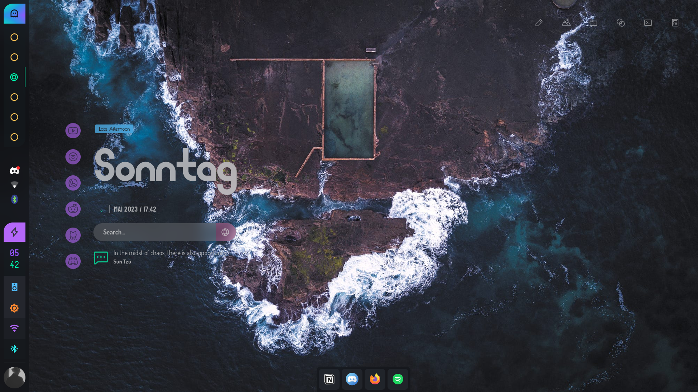
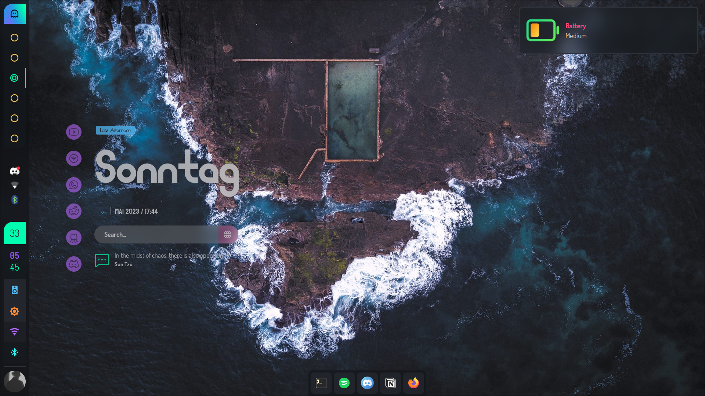
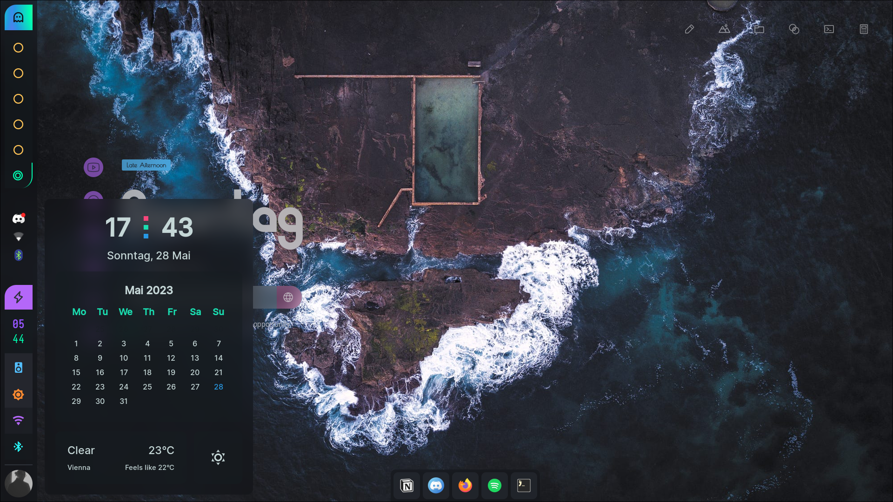
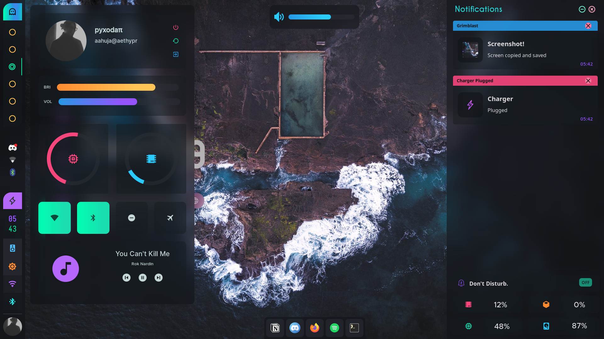
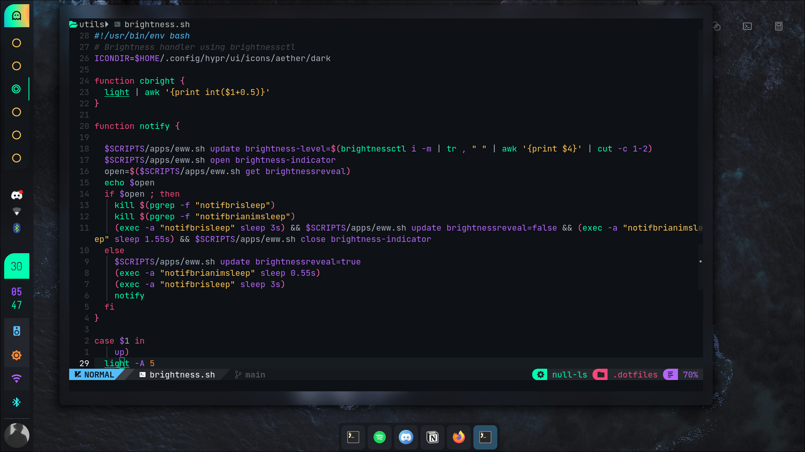

# AetherizedHypr

## Introduction

The following repository contains my personal Linux configuration files. The most interesting part probably is my Hyprland rice (desktop configuration with some eye candy).

Here is a quick overview about the key components of the setup:

- **WM**: Hyprland (-git)
- **OS**: EndeavourOS
- **Shell**: ZSH
- **Editor**: Neovim
- **Launcher**: Rofi
- **Notification** **Daemon**: Dunst
- **Dock/Bar**: Waybar

## Gallery







## Setup

**NOTE: BACKUP YOUR PREVIOUS CONFIGURATION**

I am using EndeavourOS, hence using an AUR helper. For other distributions please refer to the build instructions of the specific project. Please open a new issue if a dependency is missing.

If your device has a nvidia graphics card, install the `hyprland-nvidia-git` dependency instead of `hyprland-git`.

*Assuming your AUR helper is `yay`*

```bash
yay -S acpi acpid battop btop dunst dolphin eww-wayland firefox foot gammastep hwinfo hyprland-git hyprpicker-git light-git lightly-git nwg-look pavucontrol-qt playerctl psuinfo python-pip qt5ct rofi-lbonn-wayland-git slurp stow swaylock-effects swww waybar-hyprland-git waylock yaru-sound-theme zsh
```

```bash
pip install dbus-python PyGObject python-mpd2 requests Wand
```

Then just clone the repository into your `$HOME` directory and stow it.

```bash
git clone https://github.com/ahujaankush/AetherizedDots $HOME/.dotfiles
cd $HOME/.dotfiles && stow .
fc-cache -v
```

## File structure - Hyprland

Everything specifically related to the Hyprland rice can be found in `$HOME/.config/hypr/`. In the directory you will find the following files/folders:

- hyprland.conf: The main configuration file
- Wallpaper.png: The wallpaper loaded at the start of the desktop
- plugins/: Plugins loaded by Hyprland, compile them again before using them (explained in the [Hyprland wiki](https://wiki.hyprland.org/Plugins/Using-Plugins/))
- scripts/: Scripts used by the desktop, mostly very simple stuff which makes life easier
- ui/: UI stuff such as the notification daemon, the widgets or the bar(s)

## Notes

If any questions or issues occur, first check if a issue regarding your problem already exists. If there isn't any, then you can of course create a new one. Please take the time to explain your problem thoroughly, as this is the only way I can help you. Thank you!
